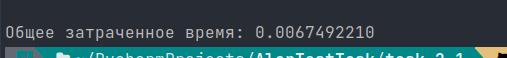
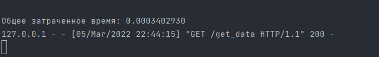

# Тестовое задание для AlarStudios.

Проект рассчитан на то, что уже имеется postgresql 13+ версии и python3.7+.

Проект успешно работает на ArchLinux, на windows не тестировал.

# (*Задание первое*)

Перед начало работы с проектом, необходимо создать базу данных. Тк мы используем postgresql, то действуем следующим
путем:

- *sudo -u postgres psql*
- *CREATE DATABASE [Ваше название бд];*
- *CREATE USER [имя пользователя] WITH PASSWORD '[пароль]';*
- *ALTER ROLE [имя пользователя] SET client_encoding TO 'utf8';*
- *ALTER ROLE [имя пользователя] SET default_transaction_isolation TO 'read committed';*
- *ALTER ROLE [имя пользователя] SET timezone TO 'UTC';*
- *GRANT ALL PRIVILEGES ON DATABASE [название бд] TO [имя пользователя];*

**(Это стандартные настройки бд, которым я пытаюсь всегда следовать)**

Находясь в папке проекта (ArarTestTask/task_1) выполнить следующую последовательность команд:

- *Открыть файл **init.sh** любым текстовым редактором и внести туда правки (строка 6)*
- *sh init.sh* **(Запуск настроек. В процессе работы скрипта будут выставлены необходимые переменные окружения,
  настроена бд и начнется создание суперпользователя(seed базы со всеми правами))**
- *sh start.sh* **(Запуск работы сервера. Решил немного автоматизировать запуск через консоль😄)**

P.S.

Я использовал как AJAX(Редактирование пользователей, удаление пользователей) так и формы(Вход и регистрация).

# (*Задание второе*)

Задание я реализовал двумя способами, так как не до конца понял его, но очень надеюсь, что и первый и второй верен.

# (*Способ первый(task_2_1)*)

Здесь я реализовал три параллельных запроса на сервер и корреляцию данных на клиенте. Скорее всего этот метод стал
неверным, тк не до конца понял.

Находясь в папке с проектом (**AlarTestTask/task_2_1**) выполнить следующую последовательность команд:

- *sh start.sh* **Настройка и запуск сервера. В процессе так же рандомно перезаписываются три JSON файла по вашим
  условиям**
- **(Отключить это можно, убрав строчку *6* из start.hs)**
- *Переключение на другой сеанс консоли*
- *sh get_correlation.sh* **Получить коррелированный результат из файлов**

+ Общее затраченное время отображается в скрипте клиента **get_correlation.sh**
  

# (*Способ второй(task_2_2)*)

Здесь я реализовал один запрос на сервер, где и происходит корреляция. Скорее всего этот метод является верным, поэтому
я его и сделал.

Находясь в папке с проектом (**AlarTestTask/task_2_2**) выполнить следующую последовательность команд:

- *sh start.sh* **Настройка и запуск сервера. В процессе так же рандомно перезаписываются три JSON файла по вашим
  условиям**
- **(Отключить это можно, убрав строчку *6* из start.hs)**
- *Переключение на другой сеанс консоли*
- *sh get_correlation.sh* **Получить коррелированный результат из файлов**

+ Общее затраченное время отображается в скрипте сервера **start.sh**
+ 
